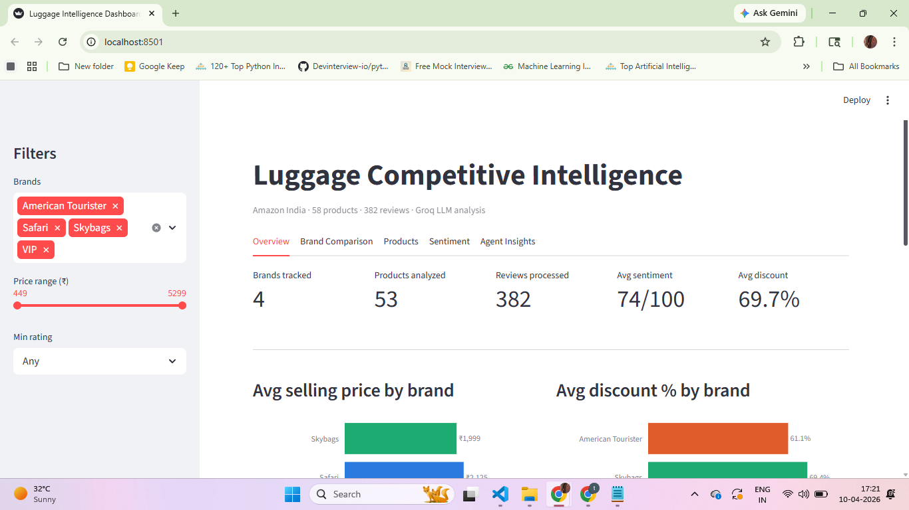
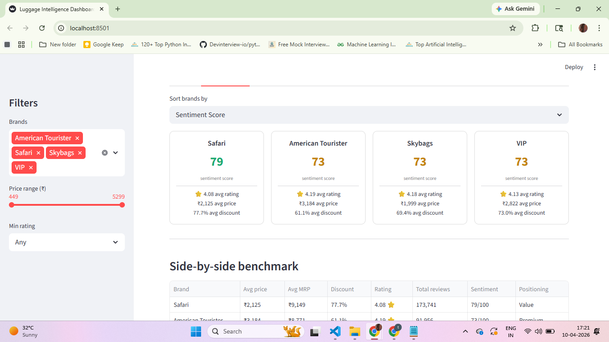
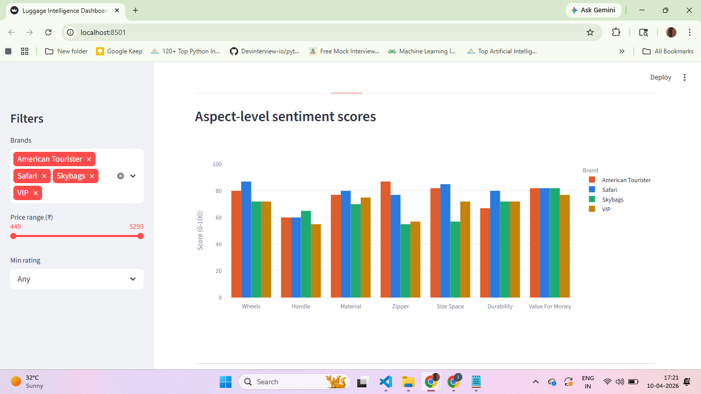
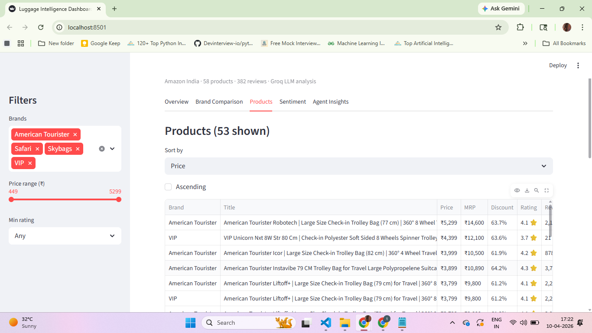

# Luggage Competitive Intelligence Dashboard

An agentic pipeline that scrapes Amazon India product listings and reviews,
analyzes them with Groq LLM, and presents competitive insights in an
interactive Streamlit dashboard.

---

## Dashboard Preview

### Overview


### Brand Comparison


### Sentiment Analysis


### Products


### Agent Insights


---

## Project Structure

```
project/
├── app.py                    ← Streamlit entry point
├── run_pipeline.py           ← Master orchestrator: scrape → clean → analyze
├── requirements.txt
├── README.md
├── .env                      ← GROQ_API_KEY (git-ignored)
├── auth.json                 ← Amazon session (git-ignored)
├── scraper/
│   └── amazon_scraper.py     ← Playwright-based Amazon India scraper
├── analysis/
│   ├── data_cleaner.py       ← Normalize, dedupe, validate scraped data
│   └── llm_analyzer.py       ← Groq LLM sentiment + theme extraction
├── dashboard/
│   └── app.py                ← 5-tab Streamlit dashboard
├── docs/
│   └── screenshots/          ← Dashboard preview images
└── data/
    ├── raw/                  ← Scraped JSON per brand (git-ignored)
    ├── clean/                ← products_clean.csv, reviews_clean.csv,
    │                            brand_analysis.json, insights.json,
    │                            brand_summary.csv
    └── sample/               ← Pre-generated example dataset
```

---

## Architecture

```
Amazon India
     │
     ▼
amazon_scraper.py      Playwright, human-like delays, saved auth session
     │
     │  data/raw/<brand>.json
     ▼
data_cleaner.py        Dedupe reviews, validate brand-title match,
     │                 compute discount %, flag bundle products
     │
     │  data/clean/products_clean.csv
     │  data/clean/reviews_clean.csv
     ▼
llm_analyzer.py        Groq llama-3.3-70b-versatile
     │                 Sentiment score, 7 aspect scores, pros/cons,
     │                 trust flags, cross-brand insights
     │
     │  data/clean/brand_analysis.json
     │  data/clean/insights.json
     │  data/clean/brand_summary.csv
     ▼
dashboard/app.py       Streamlit + Plotly, 5-tab interactive dashboard
```

---

## Setup

### 1. Clone and install

```bash
git clone <your-repo-url>
cd project
python -m venv venv
venv\Scripts\activate          # Windows
# source venv/bin/activate     # Mac/Linux
pip install -r requirements.txt
playwright install chromium
```

### 2. Environment variables

Create a `.env` file in the project root:

```
GROQ_API_KEY=your_groq_api_key_here
```

Get a free key at https://console.groq.com

### 3. Amazon login (required for scraping)

The scraper reuses a saved browser session to bypass CAPTCHA. Run this once:

```bash
python scraper/save_auth.py
```

A browser opens — log in to Amazon India manually, then close it. This saves
`auth.json` which all subsequent scraper runs reuse. Re-run if you get login
errors (sessions expire after ~7 days).

---

## Running the pipeline

### Option A — Full pipeline (recommended)

```bash
python run_pipeline.py
```

Runs all steps sequentially. Scraping takes ~45–60 minutes for 4 brands due
to human-like delays between requests. Already-scraped brands are skipped
automatically.

### Option B — Step by step

```bash
# 1. Scrape Amazon India (skips brands already in data/raw/)
python scraper/amazon_scraper.py

# 2. Clean and deduplicate
python analysis/data_cleaner.py

# 3. LLM analysis via Groq
python analysis/llm_analyzer.py

# 4. Launch dashboard
streamlit run dashboard/app.py
```

### Option C — Skip scraping, use included dataset

The `data/clean/` folder is included in this repo. You can skip straight to
the dashboard:

```bash
streamlit run dashboard/app.py
```

---

## Dataset

| Brand | Products | Unique reviews | Avg price |
|---|---|---|---|
| American Tourister | 15 | 110 | ₹3,184 |
| Safari | 14 | 68 | ₹2,125 |
| Skybags | 15 | 104 | ₹1,999 |
| VIP | 14 | 100 | ₹2,822 |
| **Total** | **58** | **382** | — |

Scraped April 2026. Data reflects Amazon India listings at time of scraping.

---

## Dashboard tabs

| Tab | What it shows |
|---|---|
| Overview | Key metrics, avg price by brand, avg discount by brand, price vs sentiment scatter plot |
| Brand Comparison | Sentiment score cards, sortable benchmark table, pros/cons per brand |
| Products | Filterable product table with sort, drilldown view with scraped reviews |
| Sentiment | Aspect-level scores (wheels, handle, material, zipper, size, durability, value for money), trust signals, anomaly flags |
| Agent Insights | 5 non-obvious LLM-generated conclusions, value-for-money index chart |

---

## Sentiment methodology

Reviews are cleaned (emoji/unicode stripped, capped at 500 chars), batched
into groups of 30, and sent to `llama-3.3-70b-versatile` via Groq with a
structured JSON prompt requesting:

- Overall sentiment score (0–100)
- Top 5 positive and negative themes
- Aspect-level scores for 7 dimensions: wheels, handle, material, zipper,
  size/space, durability, value for money
- Trust flags for suspicious patterns (repetition, generic phrasing)
- One-line anomaly detection (e.g. high rating despite recurring complaint)

When a brand has more than 30 reviews, two chunks are analyzed and scores
are averaged. The **value-for-money index** is:

```
vfm_score = sentiment_score / avg_price × 1000
```

Higher = more customer satisfaction per rupee spent.

---

## Known limitations

- **Review deduplication:** Amazon shows identical reviews across color/size
  variants of the same product family. The cleaner deduplicates by exact text
  match per brand, which reduces Safari's effective count to 68 vs 100+ for
  other brands.
- **Null prices:** 2 Safari products had no listed price (out of stock at
  scrape time) and are excluded from price averages.
- **Sentiment uniformity:** Skybags and VIP both scored 73/100, likely due to
  LLM anchoring on mid-range scores for similarly mixed review sets. A larger
  review sample would improve differentiation.
- **No review pagination:** The scraper collects only the first page of reviews
  (10 per product). Multi-page scraping would increase coverage significantly.
- **Session expiry:** Amazon auth sessions expire in ~7 days. Re-run
  `save_auth.py` if scraping fails with login errors.

---

## Requirements

```
playwright
pandas
numpy
groq
streamlit
plotly
python-dotenv
requests
tqdm
```

---

## Evaluation rubric coverage

| Criteria | Implementation |
|---|---|
| Data collection | 58 products, 382 reviews, 4 brands via Playwright scraper |
| Analytical depth | Groq LLM: sentiment score, 7 aspect scores, theme extraction, anomaly detection |
| Dashboard UX | 5-tab Streamlit, Plotly charts, sidebar filters, sortable tables, product drilldown |
| Competitive intelligence | Benchmark table, price vs sentiment scatter, brand positioning, value-for-money index |
| Technical execution | Modular pipeline, skip-if-exists logic, deduplication, env-based secrets, error handling |
| Product thinking | Agent Insights tab with 5 non-obvious cross-brand conclusions generated by LLM |